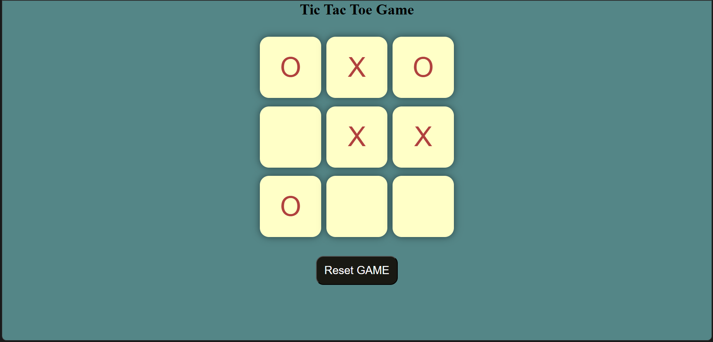

# ❌⭕ Tic Tac Toe Game

A simple and interactive Tic Tac Toe game built using HTML, CSS, and JavaScript. This project allows two players to play the classic Tic Tac Toe game in a clean and responsive interface, with automatic winner detection and game reset functionality.

## 🚀 Features

* Two-player gameplay
* Automatic winner detection
* Draw game detection
* Reset and New Game options
* Responsive and user-friendly interface
* Clean and interactive UI

## 🛠️ Technologies Used

* HTML5
* CSS3
* JavaScript

## 📸 Project Preview



## 🎯 Learning Outcomes

This project helped me learn:

* DOM Manipulation
* Event Handling
* JavaScript Functions
* Conditional Logic
* Game State Management
* Responsive Web Design

## 📂 Project Structure

```text
tic-tac-toe/
├── index.html
├── style.css
├── script.js
└── screenshot.png
```

## 👩‍💻 Author

Sakshi Sharma

B.Tech CSE Student 
